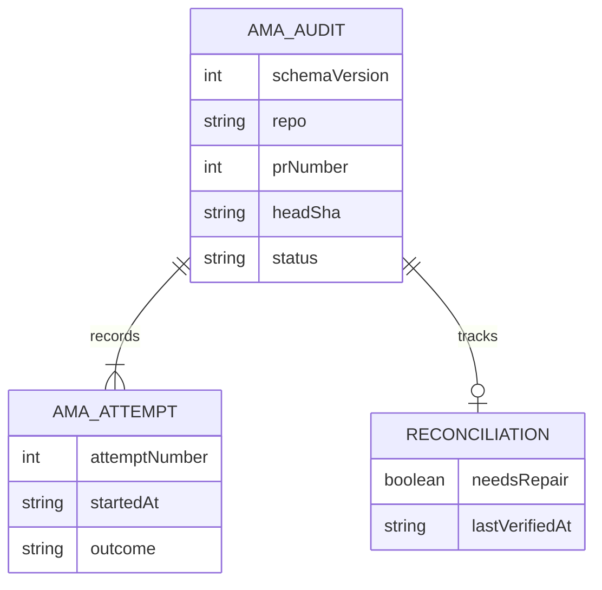

# Data Model - AMA Closure Audit

**Owner:** AMA merge authority
**Store:** `$HQ_ROOT/dispatch/audit/adversarial-merge-authority/`
**Source of truth:** `src/ama/audit.mjs`
**Runtime surface:** `bin/ama-audit.mjs`, `templates/hammer-prompt.md`, `bin/hammer-merge.sh`, `src/ama/daemon-merge.mjs`, `src/ama/closing-keywords.mjs`, `src/ama/no-ci-configured.mjs`, `src/daemon-clean-merge.mjs`, `src/ama/hammer-stop-hold.mjs`

## Purpose

One JSON document records closure attempts for a `(repo, prNumber, headSha)`
tuple. Its filename is `<repo-with-slashes-replaced>-pr-<number>-<head>.json`.
The writer serializes appends with a sibling lock file and writes JSON atomically
at mode `0640`.

| Field | Shape | Contract |
|---|---|---|
| `schemaVersion` | number | Current value is `1`. |
| `repo`, `prNumber`, `headSha` | string, number, string | Immutable record identity. |
| `createdAt`, `updatedAt` | ISO timestamps | First write and latest append. |
| `status` | string | Latest attempt outcome, except `succeeded` stays sticky. |
| `attempts` | array | Immutable ordered attempt history. |
| `appendedRecords` | optional array | Compatibility evidence recovered from trailing JSONL after the leading JSON document. Parsed lines retain their original shape; malformed lines become `{ unparsed: string }` with at most 2000 characters. Preserved by subsequent atomic rewrites, without changing `status` or numbering `attempts`. |
| `attempts[].attemptNumber` | positive integer | Sequential, starting at `1`. |
| `attempts[].startedAt` | ISO timestamp | Append time. |
| `attempts[].outcome` | string | `in_progress`, `deferred`, `superseded`, `succeeded`, or `failed-without-merge`. Other attempt fields carry caller evidence, including `closingStatus` for gate-cap parks. |
| `attempts[].attemptPhase`, `attempts[].path` | optional strings | Per-attempt producer provenance. Daemon phases are `daemon-pre-merge`, `daemon-merged`, and `daemon-failed`; `path` names its closure authority, including `ham-terminal-remediation` for a daemon call on a HAM-certified head. Hammer phases include `hammer-gh-pr-merge` and `hammer-gate-attempt-cap`. Document-level authority alone does not identify the producer of a marked attempt. |
| `reconciliation.needsRepair` | boolean | Latest append's repair signal. Present on records auto-created by append. |
| `reconciliation.lastVerifiedAt` | ISO timestamp | Latest append time. Present on records auto-created by append. |
| `closingKeywordRewrites` | optional array | Title and body rewrites computed by the daemon; absent on older records. Each item is `{original, referencedNumber, referencedRepo, replacement}`. |
| `attempts[].closingKeywordRewrites` | optional array | Per-attempt message rewrites, including hammer shell attempts. Same item shape as the top-level field. |
| `attempts[].resumeOwed` | optional boolean | Hammer terminal attempts set this to `true` only for `reason: required-checks-pending`; other reasons write `false`. Audit-only evidence that the bounded worker deferred for pending CI. Older and non-hammer attempts may omit it. |
| `attempts[].resumeHead` | optional string or null | The exact validated head SHA when `resumeOwed` is `true`; otherwise `null`. Diagnostic evidence for operators, not a dispatch trigger or merge authorization. |
| `closureAuthority`, `reviewer`, `riskClass`, `flagState`, `ciMode` | optional provenance | Watcher-owned metadata, or caller-provided metadata when an append creates a missing record. `ciMode` is `github-checks` or `no-ci-bootstrap`. |
| `ciConfigurationAdmission`, `attempts[].ciConfiguration` | optional `{ reason, repo, base, head, baseHead, checkedAt }` | Only the operator-authorized no-CI daemon route. Top-level admission metadata holds the pre-lease proof; the successful `daemon-merged` attempt holds its latest in-lease proof. All identity fields are strings; `checkedAt` is an ISO timestamp and `reason` is `no CI configured`. |

`appendAmaAuditAttempt` may create a missing head record. That first append
includes the reconciliation block and any supplied provenance metadata. Later
appends preserve existing metadata and update reconciliation. A successful
record cannot be demoted by a later append.

`parseAmaAuditDocument` accepts a valid leading object followed by non-empty
JSONL lines and exposes them as `appendedRecords`; unrelated parse failures
still throw. This is recovery for historical hand-appended hammer evidence,
not a second writer protocol. Records can carry `outcome`, `reason`, `head` /
`currentHead` / `headSha` / `validatedHead`, `closingStatus`, `next`, and
`timestamp` / `recordedAt` without the numbered-attempt shape.

The [hammer stop hold](hammer-stop-hold.md) reads both arrays for the live and
reviewed heads, choosing the latest matching hammer terminal decision by
`startedAt` / `timestamp` / `recordedAt`, then array order. Explicit hammer
phases (`hammer-*` or `before-hammer-*`) are accepted only with no path or a
hammer path (`hammer`, `ham-terminal-remediation`); other explicit phases are
excluded. A path without a phase must be a hammer path. Legacy entries with
neither marker are accepted only when document `closureAuthority` is absent
or a hammer path. Explicit hammer provenance wins over document metadata;
daemon attempts never set or clear a hammer decision. A latest hammer
`failed-without-merge` or legacy `no-merge` starts a hold; a later hammer defer
or success clears it.

`resumeOwed` / `resumeHead` have no runtime consumer. The watcher independently
proves the closer-only ancestry from the reviewed head on each tick and reads
live exact-head CI. Pending-only checks hold without charging automated recovery;
green checks permit the normal leased resume, and failed checks reach the capped
hammer repair lane. Missing audit markers do not suppress those evaluations.

For primary-change evidence, a post-lease `primary-change-read-failed` or
`primary-change-unknown` gate
writes `reason: gate-read-failed`, `permanent: false`, and the concrete reason
in `eligibilityReasons` / `preMergeReasons`. It omits `manualCloseRequired`,
so a later tick may retry the same head after GitHub reads recover.

`closingKeywordRewrites` records the explicit merge subject and body sanitization,
with title rewrites before body rewrites. `original` and `replacement` are raw
author-text snippets (including whitespace), not trusted commands or markup;
consumers must escape them when rendering. `referencedNumber` is numeric and
`referencedRepo` is `null` for local `#N` / `GH-N`, or the referenced owner/repo
for qualified and GitHub URL references. Actual self-PR references are exempt.
An empty array means no supported closing-keyword adjacency was rewritten; it
is not proof that other merge surfaces or individual commits are sanitized.
The top-level field describes the daemon's bootstrap message; immutable
attempt entries are authoritative for later attempts.

The hammer exports `HAM_AMA_TRAILERS` from the canonical dispatch-time
`composeAmaTrailers` block, preserving reviewer family, eligibility reason and
`ama-audit:<repo>:pr-<number>:head-<sha>` trace identity. Its message helper fails
closed when that block is missing; it never synthesizes substitute provenance.
No-CI evidence corroborates the operator's explicit repository declaration in
`roles.adversarial.merge_authority.no_ci_repositories`; it is not inferred from
an empty rollup alone. Live reads cover base/head Actions and known external-CI
configs, head check suites and commit statuses, all effective rule pages, and
classic branch protection. Live proof waives required adversarial-gate protection
only for the declared repository's daemon call; the domain policy still applies
to every call without proof.
Top-level evidence records admission intent, not proof of a successful merge;
only the successful attempt records the proof used at closure. In-lease
transient configuration lookup errors write `reason: gate-read-failed`,
`permanent: false` and omit `manualCloseRequired`. Permanent probe errors refuse
proof instead of deferring. Revoked proof or newly appearing CI records
`reason: gate-not-eligible`, `permanent: false` with the real eligibility reasons
and omits `manualCloseRequired`, permitting a later same-head retry.
