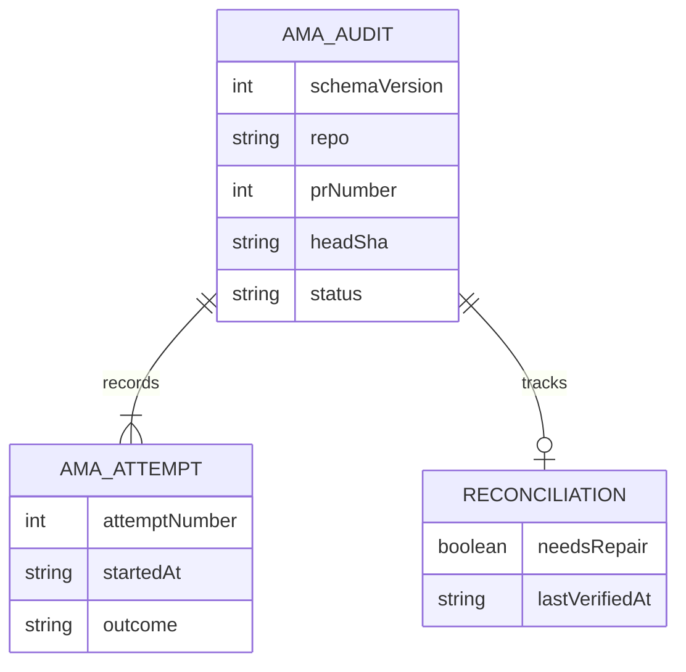

# Data Model - AMA Closure Audit

**Owner:** AMA merge authority
**Store:** `$HQ_ROOT/dispatch/audit/adversarial-merge-authority/`
**Source of truth:** `src/ama/audit.mjs`
**Runtime surface:** `bin/ama-audit.mjs`, `templates/hammer-prompt.md`, `src/ama/daemon-merge.mjs`

## Purpose

One JSON document records closure attempts for a `(repo, prNumber, headSha)`
tuple. Its filename is `<repo-with-slashes-replaced>-pr-<number>-<head>.json`.
The writer serializes appends with a sibling lock file and writes JSON atomically
at mode `0640`.

| Field | Shape | Contract |
|---|---|---|
| `schemaVersion` | number | Current value is `1`. |
| `repo`, `prNumber`, `headSha` | string, number, string | Immutable record identity. |
| `createdAt`, `updatedAt` | ISO timestamps | First write and latest append. |
| `status` | string | Latest attempt outcome, except `succeeded` stays sticky. |
| `attempts` | array | Immutable ordered attempt history. |
| `attempts[].attemptNumber` | positive integer | Sequential, starting at `1`. |
| `attempts[].startedAt` | ISO timestamp | Append time. |
| `attempts[].outcome` | string | `in_progress`, `deferred`, `superseded`, `succeeded`, or `failed-without-merge`. Other attempt fields carry caller evidence, including `closingStatus` for gate-cap parks. |
| `reconciliation.needsRepair` | boolean | Latest append's repair signal. Present on records auto-created by append. |
| `reconciliation.lastVerifiedAt` | ISO timestamp | Latest append time. Present on records auto-created by append. |
| `closureAuthority`, `reviewer`, `riskClass`, `flagState` | optional provenance | Watcher-owned metadata, or caller-provided metadata when an append creates a missing record. |

`appendAmaAuditAttempt` may create a missing head record. That first append
includes the reconciliation block and any supplied provenance metadata. Later
appends preserve existing metadata and update reconciliation. A successful
record cannot be demoted by a later append.

For primary-change evidence, a post-lease `primary-change-read-failed` gate
writes `reason: gate-read-failed`, `permanent: false`, and the concrete reason
in `eligibilityReasons` / `preMergeReasons`. It omits `manualCloseRequired`,
so a later tick may retry the same head after GitHub reads recover.
