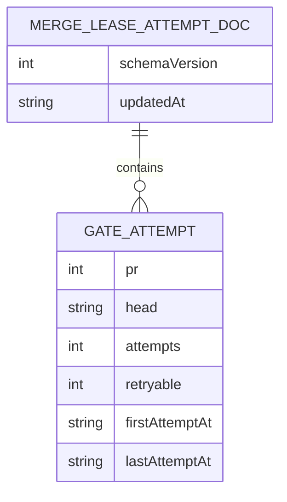

# Data Model - Merge Lease Gate Attempts

**Owner:** AMA hammer merge gate
**Store:** `data/merge-leases/<repo>__<base>.attempts.json`
**Source of truth:** `src/ama/merge-lease.mjs`
**Runtime surface:** `bin/merge-lease.mjs`, `templates/hammer-prompt.md`

## Purpose

The file records charged gate attempts and refunded retryable aborts for each
`(repo, base, PR, head)` before the hammer acquires the merge lease. The file
slug comes from `deriveLeaseKey`; the document is keyed by `(repo, base)` and
each `attempts[]` entry by `(pr, head)`.

| Field | Shape | Contract |
|---|---|---|
| `schemaVersion` | number | Current value is `1`. |
| `updatedAt` | ISO timestamp or null | Last mutation time. |
| `attempts` | array | Entries sorted by PR number, then head. |
| `attempts[].pr` | positive integer | PR number. |
| `attempts[].head` | string | PR head being gated. |
| `attempts[].attempts` | non-negative integer | Charged acquisitions; the cap uses this count. |
| `attempts[].retryable` | non-negative integer | Refunded retryable aborts, retained for diagnosis. Legacy entries without this field read as zero. |
| `attempts[].firstAttemptAt` | ISO timestamp | First attempt on this PR/head. |
| `attempts[].lastAttemptAt` | ISO timestamp | Latest attempt or refund; entries expire after 30 days. |

`acquire` records a provisional attempt and parks when the charged count
exceeds `AMG_MAX_GATE_ATTEMPTS`. A normal release leaves it charged. A
retryable-abort release or acquire wait timeout decrements one charged attempt
and increments `retryable`. `reset-attempts` removes one PR/head entry while
refusing a current lease holder. All mutations take the waiter and attempt
mutation locks; writes replace the JSON file atomically.
